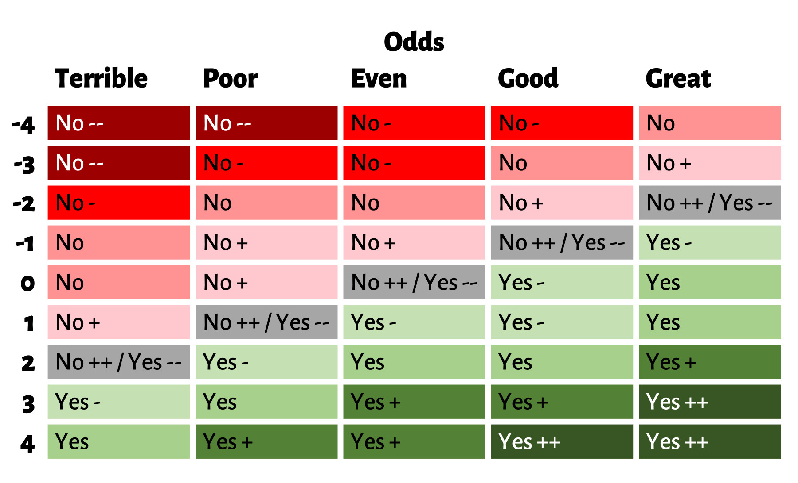

# Silnik Solo do FATE

## Wyrocznia

Wyrocznia jest używana podczas zadawania pytań tak/nie w grze. Wzdłuż górnej części znajdują się szanse, które określają prawdopodobieństwo odpowiedzi pozytywnej.

Niektóre wyniki mają dwie opcje. Pierwsza niepusta kostka wymusza wynik we wskazanym kierunku (plus lub minus). Jeśli wyrzucisz 4 puste kostki, będziesz mógł wybrać jaki wynik chcesz uzyskać.
Jeśli nie ma przewagi/utrudnienia w scenie, gdy wyrzucisz `-`, `--`, `+` lub `++`,  zadaj kolejne pytanie, aby określić
modyfikator.
Jeśli nie ma oczywistego pytania użyj tabeli losowej, aby odkryć co oznacza modyfikator.

## Czynnik zaskoczenia

Rzut na czynnik zaskoczenia (`CZ + 4dF`) jest aktywowany za każdym razem, gdy na wyroczni Fate Solo zostanie wyrzucony znak `-` lub `+`. Jeśli  wyrzucisz `--` lub `++` , należy je rzucić dwukrotnie na czynnik zaskoczenia. Jeśli wynik rzut będzie wyższy niż Próg Zaskoczenia - dzieje się coś niespodziewanego.

**Próg zaskoczenia:**

- 3: Drobna niespodzianka - Niektóre drobne rzeczy nie są takie, jak się wydają
- 5: Umiarkowane zaskoczenie - Scena obiera nowy kierunek.
- 6: Duże zaskoczenie - Przygoda obiera nowy kierunek. Możliwe jest również, że świat, znany bohaterowi ulega zmianie

Współczynnik Zaskoczenia zaczyna się od Słabego (0). Każda scena z wynikiem wymagającym rzutu na współczynnik zaskoczenia, ale bez niespodzianki -  zwiększa współczynnik zaskoczenia dla następnej sceny o 1 (Słaby (0), Przeciętny (1), niezły (2), dobry (3), świetny (3)
Gdy pojawi się niespodzianka, współczynnik zaskoczenia dla następnej sceny spada od razu do poziomu słabego (0).

Z niespodzianką mamy do czynienia, gdy ujawniona zostaje nowa informacja lub zmieniona zostaje stara informacja.
Niespodzianka powinna być związana z zadanym pytaniem - jeśli jest to możliwe. Nawet jeśli niespodzianka nie jest związana z pytaniem pozytywna odpowiedź oznacza, że niespodzianka powinna być pozytywna, a negatywna odpowiedź oznacza, że niespodzianka jest zła.

Istnieją 3 poziomy zaskoczeń:

1. Drobna niespodzianka jest wtedy, gdy pojawia się nowa / ciekawa rzecz. Nie zmienia ona wiele, ale sprawia, że rzeczy są inne w sposób, którego się nie spodziewałeś. Twój najlepszy przyjaciel wrócił ze swoją byłą.
2. Umiarkowana niespodzianka jest wtedy, gdy scena zmierza w innym kierunku niż myślałeś. PC chce ominąć strażnika pilnującego drzwi. Ale strażnik "zmienia" stronę i dołącza do PC ponieważ ich misje są takie same.
3. Dużym zaskoczeniem jest, gdy wszystko się zmienia

Przykładowe sposoby wprowadzania niespodzianek:

Oto niektóre sposoby wprowadzania niespodzianki:

- Ożywić coś, co było "martwe".
- Postać nie wie, kim jest.
- Konflikt został rozwiązany. Nowy, poważniejszy konflikt w przyszłości.
- Główna postać zostaje zabita na skutek rozwiązania ważnego wątku.
- Nowi wrogowie / sojusznicy.
- Nie mają pojęcia, co mieli; coś jest wewnątrz, gdy myśleli, że to zjawisko zewnętrzne.
- Akcja przyspiesza.
- Problem ukryty za innym problemem zostaje ujawniony.
- Eskalacja problemu.
- Problem nie jest rozwiązany. Rzeczy, które wydają się być rozwiązane, nie są.
- Pyrrusowe zwycięstwo / porażka. Wygrana z porażką. Przegrana ze zwycięstwem.
- Odwrócenie. A jest teraz B. B jest teraz A.
- Bardziej przerażający złoczyńca zajmuje miejsce obecnego złoczyńcy.
- Tajny plan. Albo PC zaplanował to wszystko, albo złoczyńca.
- Ktoś nie jest tym, na kogo wygląda.
- Historia w historii. Koła w kołach.
- Pomniejszy wątek zostaje podniesiony do rangi głównego wątku.

## Hakowanie Niespodzianek

Istnieje 7 sposobów na zmianę sposobu działania Czynnika Zaskoczenia:
1.Mniej niespodzianek (1): zwiększ wszystkie Progi o 1
2. Mniej niespodzianek (2): `--` lub `++` liczy się jako 1 rzut.
3. Mniej niespodzianek (3): jak 2, ale dodają 1 do rzutu Czynnika Zaskoczenia.
4. Mniej game changers: Umiarkowane i Duże Progi Zaskoczenia zwiększone o 1
5. Mniej poważnych niespodzianek: podniesienie Progu Dużej Niespodzianki do 7
6. Wszystko się zmienia: Czynnik Zaskoczenia nie zmniejsza się do końca rundy.
7. Więcej niespodzianek: Czynnik Zaskoczenia zwiększa się w każdej scenie, nawet jeśli nie wystąpi rzut na Czynnik.

## Reguła bonusowa: wymuszenia

Jeśli rzucisz `-` na wyroczni i ma to sens w grze, należy wymusić aspekt. Może to zadziałać w przypadku niespodzianki lub gdy niespodzianka nie wystąpi.
